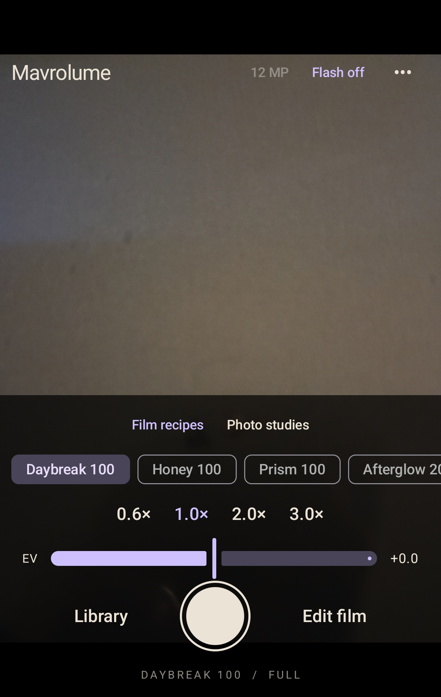
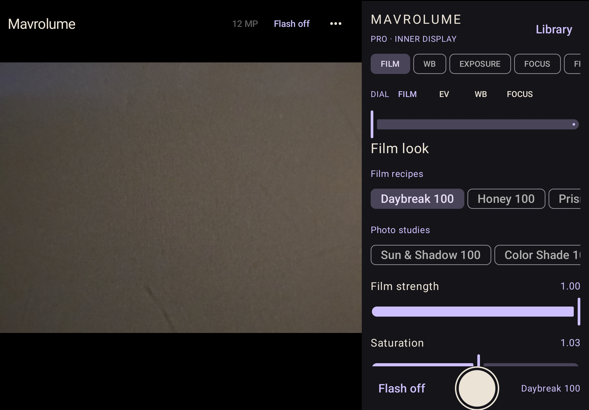

# Mavrolume

<p align="center">
  
  
</p>

**A film-minded Android camera with Fold and standard-phone builds.** Mavrolume keeps the Fold cover-screen viewfinder simple and uses the unfolded display for hands-on control. The separate Phone build keeps that simple viewfinder on any screen size. Both are native Kotlin, Jetpack Compose, CameraX and OpenGL ES apps.

> Leaving the iOS ecosystem, I wanted a camera that felt at home on my Fold 8: quick to use on the cover screen, but with real creative control when I opened it. [FilmFrame](https://github.com/ryuheiyokokawa/FilmFrame), created by **Ryuhei Yokokawa**, was the open-source starting point I admired. I built on its camera foundation, redesigned the experience for a foldable, and gave the film processing and interface my own spin.
>
> — **d4rkrolls**, project creator

Mavrolume is an independent project. It is not made, sponsored or endorsed by FilmFrame's author, Samsung, Fujifilm, Leica, Mood.camera or any other camera or film brand. Its recipes are independent interpretations, not copies of another app's LUTs or a promise to match a physical film stock.

## Features

- **Cover-screen camera:** viewfinder, film selection, lens and zoom choices, EV compensation, flash, tap-to-focus, aspect ratio and shutter access.
- **Unfolded workspace (Fold build):** Film, WB, Exposure, Focus, Frame and More pages beside the viewfinder. The inner-screen command dial switches between film look, EV, white balance and manual focus.
- **Standard-phone build:** the cover-style camera and film editor on portrait or landscape screens, without the unfolded pro workspace. It installs separately as **Mavrolume Phone**.
- **Live film processing:** 34 adjustable color and monochrome recipes. Controls include strength, saturation, warmth, tint, grain amount and size, bloom, halation, brightness, contrast, dynamic range, midtones, fade and mute. [Browse the recipes](PRESETS.md).
- **Photo output:** processed JPEG, optional original JPEG, and RAW/DNG when the selected camera configuration exposes it.
- **Framing:** 4:3, 3:2, 16:9, 1:1 and 65:24/XPan crop options.
- **Camera control:** camera switching, flash, EV compensation, and supported manual ISO, shutter and focus controls.

The app requests camera access and saves photos under `Pictures/Mavrolume`. It has no network permission and does not ask for broad storage access.

## Install on your phone

1. Choose the APK from the [latest GitHub release](https://github.com/D4rkrolls/mavrolume/releases): `mavrolume-v1.2.0-fold-debug.apk` for the Fold layout (Android 15/API 35+) or `mavrolume-v1.2.0-phone-debug.apk` for the simple layout (Android 10/API 29+). Both require OpenGL ES 3.1 and a camera. Download APKs only from sources you trust.
2. Open the APK on your phone. If Android blocks installation, allow **Install unknown apps** for the browser or file manager you used, then retry. The wording and location vary by Android version.
3. Open **Mavrolume** and allow camera access.
4. If an older debug build cannot be updated because it used a different development signing key, back up anything important and uninstall that build before installing this one.

These are **debug builds for testing**, not production-signed Play Store releases. The Phone APK has not been tested on a Huawei P60 or other non-Fold hardware. See [device testing](DEVICE-TESTING.md) before relying on either build for important photos.

## Use the camera

### Cover screen and standard phones

Point the camera and tap the subject to focus. Choose a film look along the bottom, use the zoom choices to frame, adjust EV in automatic exposure, and tap the shutter button. The top row gives access to flash, resolution where supported, and the editor. Swipe up on the viewfinder or tap **Edit film** for deeper processing controls. **Library** opens saved processed photos.

### Inner screen (Fold build)

Unfold the phone for a larger viewfinder and pro workspace. Choose one page at a time:

| Page | Controls |
| --- | --- |
| **Film** | Choose an original recipe; adjust strength, saturation, grain, bloom and halation. |
| **WB** | Choose a camera white-balance preset, then fine-tune warmth and green–magenta tint in the film rendering. |
| **Exposure** | Use EV in auto mode. If supported, switch to manual ISO and shutter; adjust brightness, contrast and tone separately. |
| **Focus** | Select a camera, zoom, switch to manual focus if supported and enable focus peaking. |
| **Frame** | Set crop, request 12 or 50 MP when available, and choose original JPEG or DNG saving. |
| **More** | Adjust fade, mute, softness and color fringing, or reset the film look. |

The **DIAL** above the pages controls film, EV, WB or manual focus. It runs on the inner screen. The physical cover display is **not** used as a second control surface while unfolded; that depends on Samsung exposing it concurrently to third-party apps, which has not been verified here.

### Saving and camera limits

The chosen recipe and adjustments affect the live preview and processed JPEG. Turn on **Save original JPEG** for an unprocessed companion image. RAW/DNG, flash, manual settings, lens choices and 50 MP depend on what the device and current camera session expose. A 50 MP sensor does not guarantee a 50 MP third-party capture. Cropping can reduce the final pixel count; the app reports capture resolution before crop.

## Build from source

Install **JDK 21** and **Android SDK Platform and Build Tools 35.0.0**, set `JAVA_HOME` and `ANDROID_HOME`, then run:

```sh
./gradlew assembleFoldDebug assemblePhoneDebug testFoldDebugUnitTest testPhoneDebugUnitTest lintFoldDebug lintPhoneDebug
```

The APKs will be `app/build/outputs/apk/fold/debug/app-fold-debug.apk` and `app/build/outputs/apk/phone/debug/app-phone-debug.apk`. With Android Debug Bridge and a connected phone:

```sh
adb install -r app/build/outputs/apk/phone/debug/app-phone-debug.apk
```

Running instrumented tests requires a connected device. See [build verification](BUILD.md) and the [physical-device checklist](DEVICE-TESTING.md). No production signing key is included.

## Device scope

The Fold APK targets a Galaxy Fold-class device; its pro workspace appears at a window size of at least 650 dp wide and 600 dp high. The Phone APK always uses the simple layout, even in landscape or on a large screen. It has a different package ID (`camera.mavrolume.app.phone`), so it can be installed beside the Fold APK. It does not depend on Google Play services. CameraX and the device determine exposed cameras, resolution modes, RAW streams and manual controls. If a camera rejects the live GPU effect, the app falls back to an unfiltered viewfinder while still processing captured photos. Huawei P60 support is a build target, not a hardware-verified claim; its software must expose Android API 29+ and OpenGL ES 3.1. Rotation, lens routing, preview performance and output quality need testing on each phone.

## Origins, credit and contributions

Mavrolume is **derived from FilmFrame by Ryuhei Yokokawa**, under the [MIT license](LICENSE). FilmFrame supplied the original CameraX/OpenGL camera foundation and portions of the gallery, crop and EXIF infrastructure. d4rkrolls directed this project and its foldable interface, film recipes, icon and reworked processing and capture flow. The provenance breakdown is in [NOTICE.md](NOTICE.md). The exact upstream notice is also bundled in the APK at `app/src/main/assets/LICENSE-FilmFrame.txt`.

Contributions are welcome; see [CONTRIBUTING.md](CONTRIBUTING.md). Keep upstream attribution, document the source and license of new assets or code, and do not submit proprietary camera-app LUTs or branding. The project is MIT licensed. No public software release can be guaranteed free of every legal or compatibility risk.
